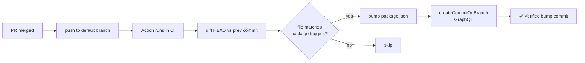

# 🏷️ easy-versioning

**Auto-bump npm package versions on PR merge using Calendar Versioning.**

---

## ✨ Highlights

- 📅 **CalVer format** — `YY.M.D` for the first bump of the day, `YY.M.D-N` for same-day collisions (e.g. `26.5.10`, `26.5.10-1`, `26.5.10-2`). Valid semver, npm-accepted.
- 📦 **Monorepo support** — path-glob config selects which `package.json` files to bump based on what changed in the merged PR.
- 🛡️ **Ruleset-friendly** — authenticates as a registered GitHub App that you add to your branch protection's bypass list. No long-lived PATs.
- ☁️ **Zero hosted infrastructure** — the App has no webhooks; the Action runs in your CI and mints short-lived installation tokens itself.
- ✅ **Verified commits** — bump commits are GPG-signed by GitHub on the App's behalf, no signing key to manage.

---

## 🚀 Quick start

1. **Register** the easy-versioning GitHub App in your org (one-time) — see [`docs/installation.md`](docs/installation.md).
2. **Install** it on your repo and add `EASY_VERSIONING_APP_ID` + `EASY_VERSIONING_PRIVATE_KEY` as repo or org secrets.
3. **Copy** [`examples/workflow.yml`](examples/workflow.yml) → `.github/workflows/easy-versioning.yml`.
4. *(Optional)* Copy [`examples/easy-versioning.yml`](examples/easy-versioning.yml) → `.github/easy-versioning.yml` for monorepo configuration.
5. **Add** the App to your default branch's ruleset bypass list.
6. **Open** a PR, merge it, watch the version bump commit appear. 🎉

---

## ⚙️ How it works

- 🔁 The action runs on `push` events to your default branch (after a PR merges).
- 🔍 It diffs `HEAD` against the previous commit to compute changed files.
- 📂 For each `packages[]` entry in your config, if any changed file matches its `triggers` globs (and isn't in the global `ignore` list), the action bumps that package's version.
- ✍️ The bump commit is created via GitHub's GraphQL `createCommitOnBranch` mutation, so it shows up as **Verified** (signed by GitHub) and is properly attributed to your App's bot identity. The commit message includes `[skip ci]` so it doesn't trigger another CI run.
- 🔢 Same-day collisions add a numeric `-N` suffix that increments per same-day bump (`26.5.10`, `26.5.10-1`, `26.5.10-2`...).

---

## 📚 Documentation

| Document | What's inside |
| --- | --- |
| 📖 [Installation guide](docs/installation.md) | App registration, secrets, workflow setup |
| 🔐 [Security model](docs/security.md) | Threat model, ruleset bypass semantics, key rotation |
| 📄 [App manifest](docs/app-manifest.json) | Pre-filled GitHub App registration template |

---

## 📜 License

MIT — see [LICENSE](LICENSE).
